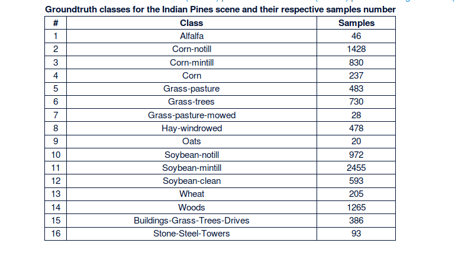
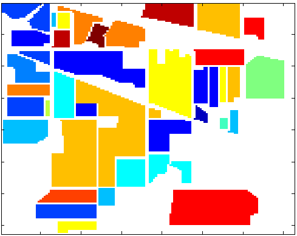

# Hyperspectral-Image-Segmentation-using-Support-Vector-Machines
This script utilizes an open source SVM library that can perform multiclass classification. The library was created by Chih-Chung Chang and Chih-Jen Lin, called [LIBSVM](https://www.csie.ntu.edu.tw/~cjlin/libsvm/).

This was an assignment for a graduate course in Remote Sensing taught at [Shanghai Jiao Tong University](www.sjtu.edu.cn). I decided that the script may be useful to other students. The assignemt was as follows:
1. Perform principle component analysis to view data
2. Take the first 3 principle components and create an RGB image from them
3. Train an SVM model to do pixelwise classification

# Data

[The indian pines](http://www.ehu.eus/ccwintco/index.php?title=Hyperspectral_Remote_Sensing_Scenes#Indian_Pines) scene is open source hyper spectral image data. The data is well documented, and list the classes with the corresponding number of pixels. The script takes only nine of these classes. 

A ground truth file exist, and can be found in the **Grupo de Inteligencia Computacional (GIC)** [website](http://www.ehu.eus/ccwintco/index.php?title=Archivo:Indian_pines_gt.png). Here is a snapshot of the ground truth file. 

#Results

WIP
